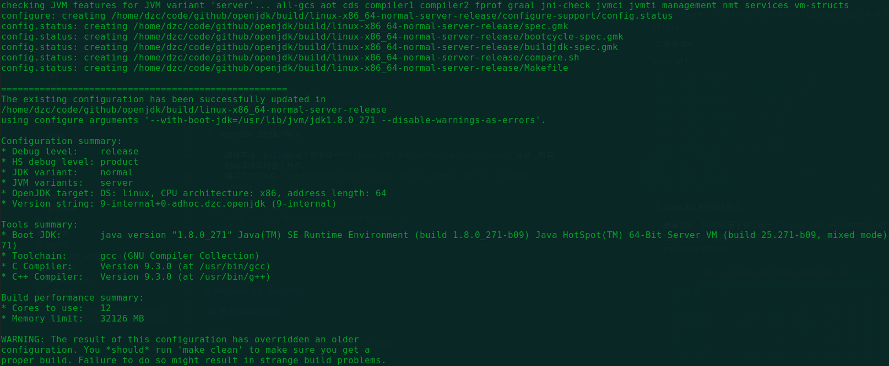
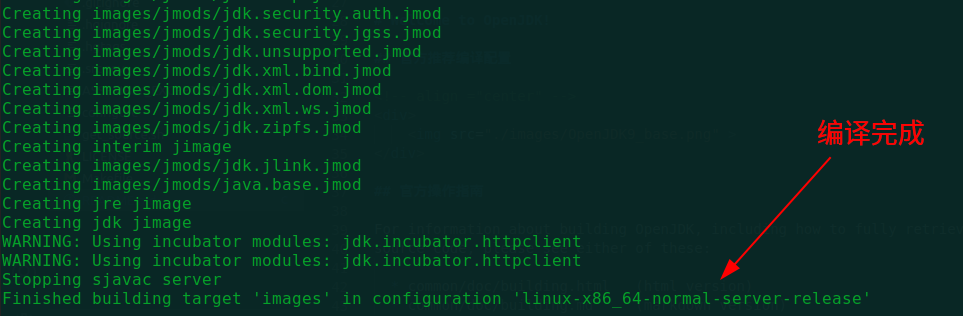
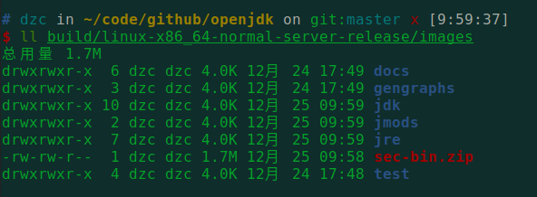
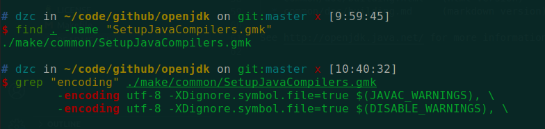
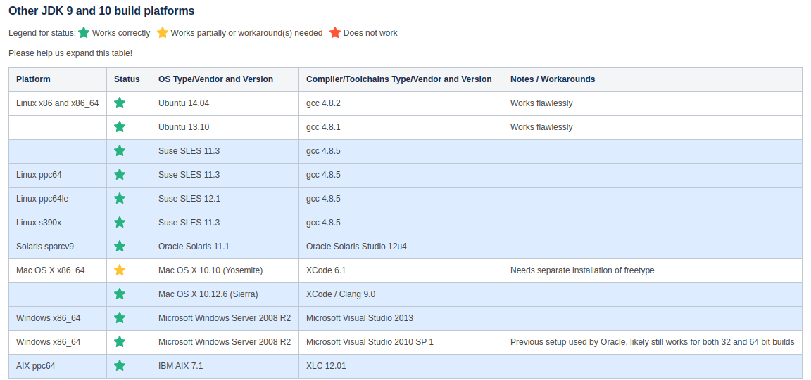

# OpenJDK源码编译

## 配置信息 

- 源码版本 `OpenJDK9` 

- 系统 `Ubuntu20.04 ` 

- boot JDK：`JDK 1.8.0_271 (build 1.8.0_271-b09)`

## 编译步骤

1. configure

> `./configure --with-boot-jdk=/usr/lib/jvm/jdk1.8.0_271 --disable-warnings-as-errors`  

    

  

2. 编译JDK  

> `make all`

    

3. OpenJDK 9的编译输出  

    编译完成，build目录下会生成一个 `linux-x86_64-normal-server-release` 目录，所有的编译成果均位于其中。
    编译后的JDK在 `jdk源码根目录/build/linux-x86_64-normal-server-release/images`，之后就可以像普通的Oracle JDK一样用。

    

  

 

## 问题

1. 源码

    源码路径在根目录 `jdk/src` 下，OracleJDK的 `rt.jar` 源码在 `jdk/src/java.base/share/classes/` 目录。

2. 编码问题

    在JDK源码中加中文注释，重新 `make images` 会报编码错误。解决方式是在根目录下找到 `SetupJavaCompilers.gmk` 文件，将 `encoding ascii` 替换为 `encoding utf-8`，同时将注释文件的编码格式转换为 `UTF-8`。

    

 
 

3. 其他版本  
    如果想编译其他版本的 OpenJDK,可以去[官网](http://jdk.java.net/)下载相应版本的源码。

 
# Welcome to OpenJDK!

## 官方推荐编译配置  

    

   

## 官方操作指南  

For information about building OpenJDK, including how to fully retrieve all
source code, please see either of these:

  * common/doc/building.html   (html version)
  * common/doc/building.md     (markdown version)

See http://openjdk.java.net/ for more information about OpenJDK.
